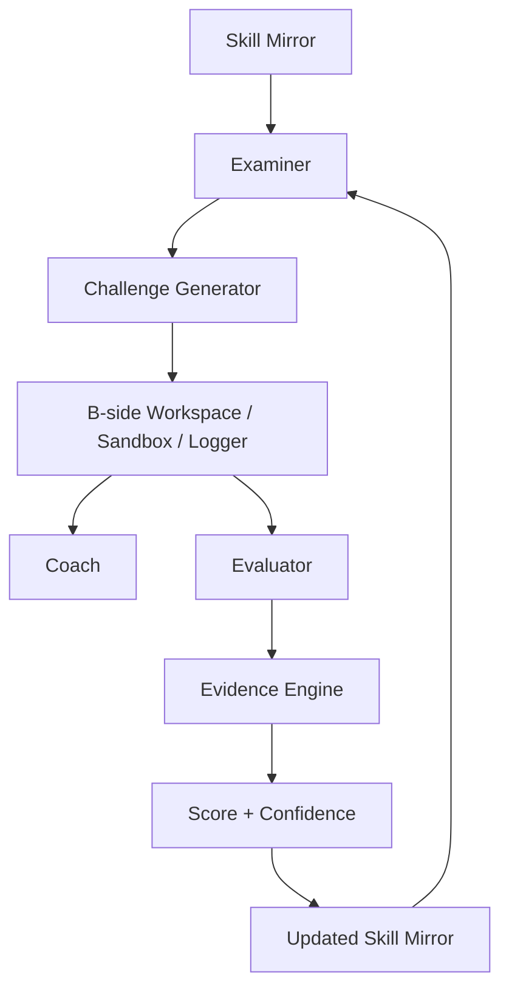

# SkillMirror Agent Architecture v2.1

## 1. 架构目标

成员 A 的验收问题不是“是否调用了大模型”，而是：**系统为什么判断某项能力是这个分数、判断有多确定、下一题为什么这样选？**

完整运行链：

## 2. 四个 Agent 为什么存在

| 模块 | 唯一职责 | 确定性锁定 | LLM 可做 |
|---|---|---|---|
| Examiner | 决定测什么 | 目标、子能力、难度、优先级 | 润色已锁定理由 |
| Challenge Generator | 决定怎么测 | 目标/难度一致性、Schema、AST 安全、可执行 oracle | 生成候选挑战 |
| Coach | 决定帮多少 | 触发阈值、三级策略、泄题拦截 | 安全改写提示语 |
| Evaluator | 解释怎么完成 | A 已重建的 verified 状态、完成事实、候选事件集合 | 润色过程解释 |

没有单独创建“Scoring Agent”：Score 与 Confidence 是确定性引擎，不需要把公式包装成 Agent。

## 3. 关键工具调用

Challenge Generator 调用 Schema Validator、AST Policy 和受限子进程 Test Oracle；Evaluator 消费 B 侧 Test Runner / Logger 记录；Evidence Engine 调用规则表和 Skill Tree；FastAPI 提供 B 侧系统调用入口。

题目质量门会先验证参考答案通过全部用例，再确认 starter 至少失败一项。它拒绝 import、属性访问、文件/网络调用和不在白名单中的函数。该门只用于团队控制的题目代码，不能替代 B 侧生产学员代码沙箱。

## 4. 失败与降级

| 故障 | 行为 |
|---|---|
| LLM 未配置 | 直接使用确定性路径 |
| LLM 超时/异常/非 JSON | 返回 fallback，不中断闭环 |
| LLM JSON 不符合 Schema | 拒绝输出 |
| LLM 试图改 Examiner 决策 | 保留锁定决策 |
| 生成挑战不可执行/危险/oracle 错误 | 使用已验证固定模板 |
| Coach 疑似泄露参考答案 | 使用固定渐进提示 |
| B record HMAC/身份/摘要无效，或只有 public scope | A 重建为 unverified，不产生完成 Evidence |
| Verification Record / Evidence 的 A HMAC 无效 | Materialization / Score / Confidence fail closed |
| Evidence 引用跨用户/会话/挑战 | 拒绝候选 |
| 无有效 Evidence | Score 保持 Unknown/不变，Confidence 为 0 |

## 5. 状态与边界

A 侧函数本身无数据库状态；状态由输入中的 Skill Mirror、A-signed Evidence History 和 Previous Challenges 显式携带，便于复现和测试。成员 B 负责持久化、用户认证、生产沙箱、B 记录签名、重放唯一约束与用户界面。

API 默认只返回 learner-safe challenge。内部 server view 含隐藏测试和参考答案，要求环境变量注入的服务 token，并且返回 A-signed Challenge；它必须停留在可信 B 后端。完整角色与数据边界见 `SECURITY_TRUST_BOUNDARY.md`。
