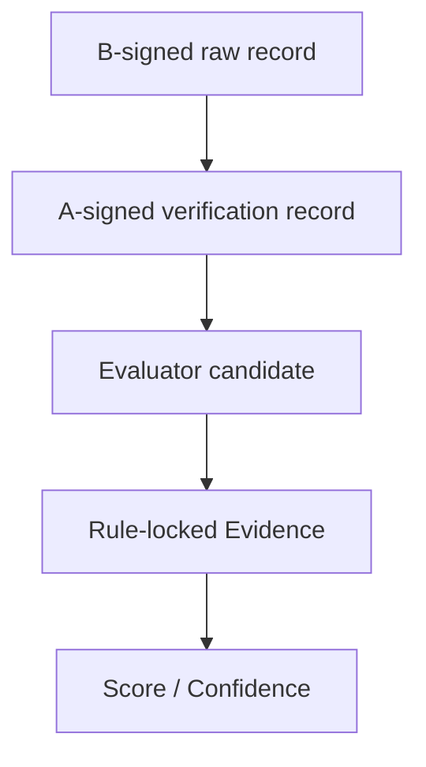

# Evidence 机制说明

## 1. 三层证据链

- Raw record：B 侧可信 Runner/Logger 产生并以 B Provenance Secret 签名的测试、操作、代码版本和提示记录。
- Verification record：A 验证 B HMAC 与身份/内容绑定后，标准化为 `ref_id/type/status/user/session/challenge/challenge_digest/payload_digest`，再以 A Secret 签名。
- Candidate：Evaluator 只提出 `event + verification_refs + reason`。
- Evidence：规则表决定技能、强度、方向、表现分、可靠度和 required record types。

## 2. 为什么 LLM 不能改分

Evidence Engine 忽略 Candidate 中任何 `skill`、`sub_skill`、`strength`、`performance_score`、`reliability` 等字段。即使 LLM 候选伪造“coding / 0 分 / weak”，最终值仍按 `evidence_rules.json` 的 `EVR-OUTCOME-001` 和当前目标能力生成。

这意味着 LLM 的权限只有“提出一个可验证事件”，没有“制定评分规则”或“宣告客观通过”。

## 3. 接收条件

候选只有同时满足以下条件才进入 accepted：

1. 事件存在于版本化规则表。
2. 至少有一个 verification ref。
3. 每个引用都能找到 A Evaluator HMAC 有效且状态为 verified 的 record。
4. record 的 user/session/challenge/challenge digest/目标能力/难度与上下文完全一致。
5. record type 覆盖规则要求，如完成事件必须有 `hidden_test_result`。
6. record 含合法 SHA-256 payload digest。
7. Evidence 通过 Schema 2.1，并由 A Evidence Engine 签名。

公开测试、未验证测试、跨会话引用、未知事件和重复候选都会被拒绝并保留理由。

## 4. 可追溯字段

每条 Evidence 包含：稳定 `evidence_id`、`rule_id`、`rule_version`、用户/会话/挑战身份与 `challenge_digest`、技能、事件、强度、方向、performance score、difficulty、hint level、reliability、verification refs、source digest、理由、时间和 provenance。

稳定 ID 来自身份字段与引用的规范化摘要；同一候选重复提交会被检测，完整闭环在传入 History 时不会重复计分。`source_digest` 标识 Evidence 来源记录集合，A HMAC 则证明整个 Evidence 未被调用者修改。Score 与 Confidence 自身再次验证 Schema、当前 rule version 和 A HMAC，形成纵深防御。

`verification_status` 不是信任声明：A Pipeline 会忽略调用者提供的值，并根据 B record HMAC、user/session/challenge、record type、submission digest 和 challenge digest 重新覆盖状态。自写 `verified` 无法产生 accepted Evidence。

## 5. 当前规则的解释边界

规则是 MVP 专家设计参数，不是从真实用户数据训练得到。`performance_score=92` 表示“完成强证据在当前规则中的标尺值”，不能解释为真实教育测量的 92 分。后续应使用真实、授权、脱敏任务数据做标定、敏感性分析和跨群体公平性评估。
