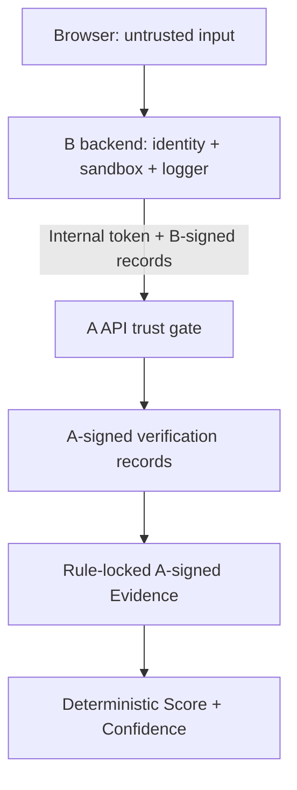

# Security / Trust Boundary v2.1

## 安全目标

v2.1 解决两个直接影响评分可信度与题库机密性的边界问题：

1. 普通调用者不能构造高分 Evidence 绕过 Materialization；
2. 浏览器或未认证调用者不能取得参考答案、隐藏测试和 hidden bugs。

安全模型不把“请求来自某个 HTTP 客户端”“对象里写了 verified”或“JSON 结构完整”视为可信来源。可信度来自分层认证、内容绑定、版本锁和 A 侧重验。

## 三个独立凭据

| 凭据 | 知道它的组件 | 能证明什么 | 不能证明什么 |
|---|---|---|---|
| Internal Token | A、B | 请求来自获准的 B 服务 | 请求体里的 Evidence 一定真实 |
| B Provenance Secret | A、B Runner/Logger | 原始运行/行为记录由可信 B 侧签发且未篡改 | 记录一定应命中哪条 Evidence 规则 |
| A Evidence Secret | 仅 A | Challenge、标准化记录或 Evidence 由指定 A 模块签发且未篡改 | B 的身份认证和沙箱本身正确 |

三个值分离可避免单点权限升级：即使 B 持有内部 token 和 B Secret，也不能自行签出 Score Engine 接受的 Evidence。所有值至少 32 字节，由环境变量注入，不存在源码默认值。

## 数据来源与处理责任

### 浏览器可产生或接收

- 可接收 learner Challenge、Starter、题面和公开测试；
- 可产生代码、编辑动作、运行请求、Hint 请求；
- 这些数据都是不可信输入，不能自行产生 `verified`、隐藏测试结果、Verification Record 或 Evidence；
- 浏览器不得收到内部 token、任何 HMAC Secret、server Challenge、完整 Test Runner oracle。

### 只能来自可信 B 后端

- 已认证的 `user_id`、`session_id` 与持久化 Skill Mirror；
- 在生产级隔离 Sandbox 中生成的 Test Runner 结果；
- Logger 形成的 action/code-version/hint 记录；
- 完整 Evidence History 与 Previous Challenges；
- 上述原始记录必须含一致身份并以 B Provenance Secret 签名。

B 是实际执行结果的信任根。A 不在完整 assessment 接口里重新执行任意学员代码，因此 B 必须保证沙箱、隐藏测试保管、Runner 完整性、数据库授权与 anti-replay 持久化。A 会验证签名与绑定，但不能从密码学上证明 B 自身没有恶意。

### A 必须重新验证

- 内部接口 token；
- server Challenge 的 A HMAC、内容摘要、Schema、AST 策略和 executable oracle；
- B record HMAC、`record_type`、user/session/challenge 身份；
- Test Result 的 submitted-code digest 与 challenge digest；
- passed/total 范围、hidden scope 和回归计数；
- Verification Record 的 A Evaluator HMAC 与上下文；
- Evidence Schema 2.1、当前 rule version、A Evidence Engine HMAC、唯一 ID；
- Evidence History 的同类检查以及已知 ID 重放。

## `verification_status` / `verification_records` 审计结论

- 外部 `verification_status` **不是信任输入**。B record 的 HMAC 设计上不签这个字段，A 在验签和身份绑定后无条件覆盖为 `verified` 或 `unverified`。
- Evaluator 仍按统一字段读取状态，但读取的是 Pipeline 已覆盖后的状态，不是 HTTP 原值。
- Evaluator 输出的 `verification_records` 由 A Secret 签名，并绑定 user、session、challenge、challenge digest、target skill/subskill、difficulty 和 payload digest。
- `/v1/evidence/materialize` 同时要求内部 token 和有效 A Verification Record HMAC。调用者自行写 `status=verified`、复制 ref ID 或修改上下文都不能落为 Evidence。
- `/v1/assessment/complete` 只接受 A 签名内部 Challenge；浏览器无法用自造题目/答案构成闭环。

## `/v1/skills/update` 信任边界

旧边界把完整 Evidence 当成普通请求 DTO，调用者可选择评分字段。v2.1 将输入改为 `trusted_evidence` / `trusted_evidence_history`，并在 API 和引擎两层分别执行 fail-closed 检查：

1. 严格 Evidence Schema；
2. `rule_version == 2.1.0`；
3. issuer/purpose 固定为 A Evidence Engine；
4. HMAC 覆盖包括 performance score、strength、difficulty、reliability、direction 在内的全部 Evidence 内容；
5. Evidence ID 不得在同请求或 history 中重放；
6. Score 与 Confidence 自身再次验签，即使绕过 API 直接调用算法也不会采纳 forged item。

伪造的 100 分 strong/expert Evidence 有三种结果：缺 provenance 时 Schema 拒绝；伪造签名时 provenance 拒绝；修改已签对象时 HMAC 失效。三者均不改变分数。

## Challenge 隐藏数据边界

- learner view 公开且按白名单删除 oracle；
- server view 在生成任何响应体前校验内部 token；
- 无 token、错 token 返回 401，不返回 reference solution、hidden tests、hidden bugs；
- 安全配置缺失/过短返回 503，服务 fail closed；
- server Challenge 由 A 签名，assessment 会重验，防止 B 请求路径上的意外篡改；
- B 后端必须进行字段级响应控制，严禁把 server response 缓存到公共 CDN、记录完整响应或发送到浏览器。

## 重放与状态边界

Evidence ID 由 user/session/challenge/event/refs/rule version 稳定生成。A 在传入可信 History 时拒绝或忽略重复 ID，防止同一 Evidence 二次推动分数。A 服务当前无数据库状态，因此 B 必须每次传完整可信 Evidence History，并在数据库层对 assessment/session/evidence ID 建唯一约束；缺少 History 时，A 无法跨请求发现历史重放。这是明确的 B 持久化责任，不应在答辩中宣称已由无状态 A 服务完全解决。

## 已自动验证的攻击路径

- forged unsigned 100/strong/expert Evidence 不改变 Score；
- 修改已签 Evidence 的 score/difficulty/reliability 后验签失败；
- forged Evidence 不提高 Confidence；
- `/skills/update` 无 token、旧任意字段、无效签名、重放均拒绝；
- server Challenge 无 token/错 token 不泄漏隐藏数据；
- 未配置 token 时 server view fail closed；
- 自声明 `verification_status=verified` 的无签名 Test Result 不产生 Evidence；
- 修改 B 已签 Test Result 后不产生 Evidence；
- assessment 使用无签名 Challenge 被拒绝。

## 当前不覆盖

- TLS/WAF、网络分段、Secret Manager、轮换自动化、速率限制和审计平台；
- B Sandbox 的生产安全认证；
- B 数据库、用户权限、删除策略和跨租户隔离；
- 分布式 nonce 存储与无 History 条件下的全局重放检测；
- 真实攻击演练、负载测试或第三方安全审计。

这些属于部署与成员 B 系统责任；v2.1 的测试证明代码路径按上述模型工作，不等价于生产系统已经通过安全认证。
